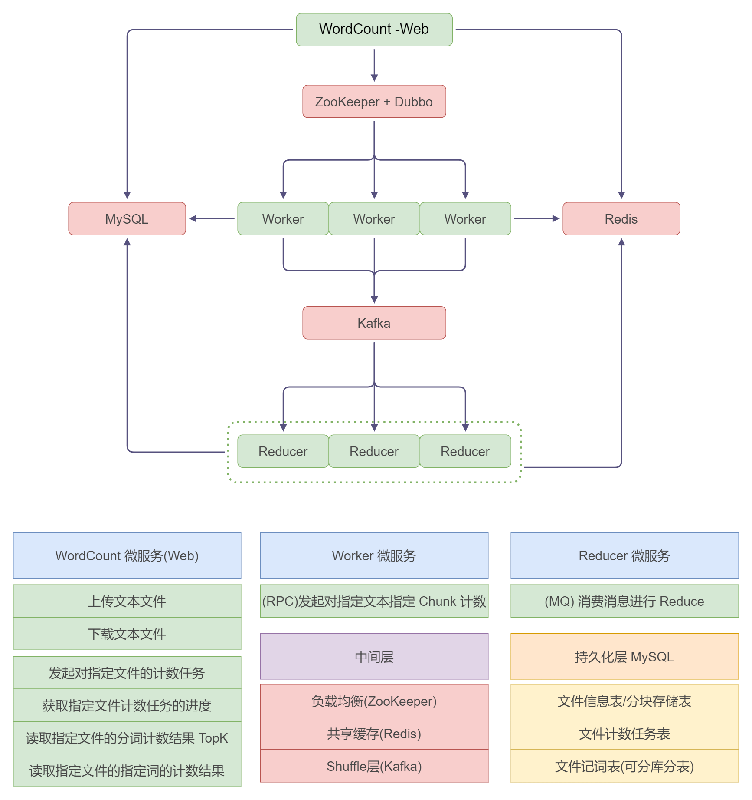

# 基于 MapReduce 想法的分词计数服务 V2.0

简介: 这是一个基于 RPC 的负载均衡和 Kafka 的动态 Partition 策略的 MapReduce 思想的分布式程序框架。

主要是为了练习和丰富技术栈，框架设计很不严谨, 这是重构后的第二个版本，依旧正在更新中。

## 项目框架:

## 项目模块

服务模块：
- DatabaseProxy : 一个 MySQl 的代理远程调用服务
- WordCountMain : Web 后端服务，用于提供 http 接口
- Workers : Worker 服务，可横向扩展，基于 Dubbo + ZooKeeper 来做负载均衡策略
- Reducer : Reducer 服务，可横向扩展，基于 Partition 的动态扩展策略（缺陷是最大数量受限于 Partition 数量）

实体模块：
- mq-domain : 消息队列实体类
- word-count-common : RPC 接口和相关实体

## 接口文档

**Restful API**

/api/v2/file

| 功能   | 方法   | 路径                  | RequestBody          |
|------|------|---------------------|----------------------|
| 上传文件 | POST | /upload             | [MultipartFile] file |
| 下载文件 | GET  | /download/{fileUid} | -                    |

/api/v2/word-count

| 功能           | 方法   | 路径/参数                   | RequestBody               |
|--------------|------|-------------------------|---------------------------|
| 开启计数         | POST | /count                  | [JSON] int fileUid        |
| 获取进度         | GET  | /progress/{taskId}      | -                         |
| topK热点词      | GET  | /file/{fileUid}/top/{K} | -                         |
| 获取指定words的计数 | GET  | /file/{fileUid}/words   | [JSON] List<String> words |

### 项目进度

基本功能完成，联调测试完成

- [ ] WebSocket 实现对客户端主动通信
- [ ] Redis 任务存储过期和延时队列线程池更新任务状态
- [ ] 定时任务清除异常任务和计数表脏数据

## Tips:

### 隐性的 Hash 冲突问题:

> 每一个分词在处理过程会经历两次 hash，第一次是在发送消息前，Worker 会按照 Partition 的个数进行分片，这个时候会对每一个 word(token) 进行一次 **hash % partition_num = partition** 来分给不同的 Partition，这样做是为了保证同一个 word 会尽可能被同一个 consumer 消费（基于kafka 的默认粘性分配策略），提高重合度利于 consumer 批次消费的时候可以合并统计数据。第二次 hash 是在 reducer 整合统计数据的时候，会通过 HashMap 来完成对多个消息的计数。
>
> 这两次 Hash 务必才用不同的 Hash 算法避免 Hash 冲突的问题，因为每个 Partition 内部的所有的 word 都满足 **hash % partition_num = partition**，同时 reducer 在整合数据的时候使用的 HashMap 里面，每个 word 插入数组的位置为 **hash % ArrayLength = idx** 如果这个时候数组的长度正好是 partition 数量的倍数，那么所有的 word 都会插入到 **idx = partition + k * partition_num** 的位置，造成严重的 Hash 冲突。
>
> 目前解决方案是两次 hash 使用不同的 hash 函数。

### WebSocket