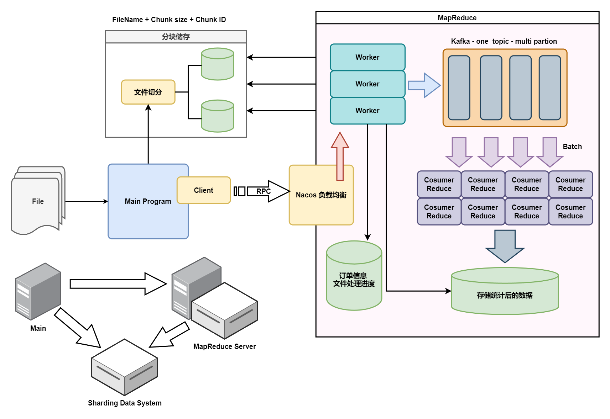
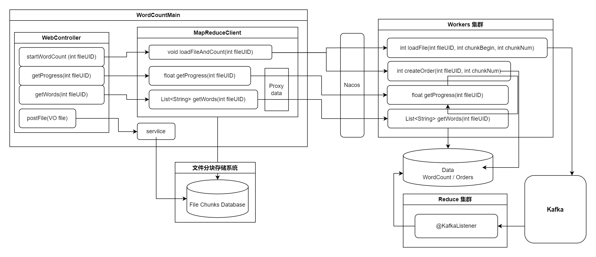

简介: 一个基于 RPC 和 Kafka 的 MapReduce 分布式程序框架, 主要是为了练习, 框架设计可能不太严谨, 后续会继续改善

## 项目大致框架:

- 主程序模块

  - 分块存储结构(简单实现)
  - MapReduce Client
- MapReduce RPC (重点)

  - **框架: Nacos + Dubbo (业内优选)**
    - 注册中心+负载均衡: nacos 自动实现
  - Workers (实例集群)
    - 创建订单
    - 获取订单进度
    - 加载文件块并处理后发送给 kafka
      - 读取一定范围的 Chunk [begin - end]
      - 尽早返回, 采用线程池并发读 file chunk 策略
      - 对每个 Chunk 进行分词, 过滤出有效词条
      - 对词条进行 Hash 分配 Partition
      - 构造消息发送, 消息回调更新订单的进度
    - 用户服务(返回高频词计数列表)
  - Kafka (Mapper)
  
    - 一个 topic 下面多个 Partition 实现 Mapper 的功能
    - 对消费者组(Reduce)自动分配, 可扩展性高
    - 增加扩展性的同时, 采用粘性策略, 这样保证同一个 Reduce 的服务实例可以尽消费可能相似的中间信息
  - Reduce (消费者集群) 
  
    - 对批次的 Message 进行消费, 统计词频后写入数据库


## 接口框架



## Details:

### 项目前置条件:

- 已经实现高可用的可靠分布式大型文件分块存储系统，本次项目中暂时用ShardingSphere + MySQL 代替

- 分块的文件已经储存在数据库中，并且 Worker 集群可以直接进行读取

### 项目进度

- [x] 配置 dubbo + nacos 环境

- [x] parent maven 配置 + RPC 接口设计 + RPC 配置

- [x] 实现简单的分布式(单机模拟)分块存储
  - [x] 数据表设计, FileChunkMapper 设计
  - [x] Controller 设计, VO 设计
  - [x] Service 实现: 简单文本分块储存
  
- [x] WordCountClient (本地)
  - [x] 接口
  
  ```java
  public interface WordCountClientService {
      
      void startCountWord(int fileUID); // 有事直接抛异常
      float getProgress(int fileUID);
      List<String> getWords(int fileUID);
      
  }
  ```
  
  - [x] 实现类 Client 通过 RPC 调用 Worker 
  
- [x] Worker 
  
  - [x] RPC 接口
  
  ```java
  public interface WorkerService {
  
      int loadFile(int fileUID, int chunkBegin, int chunkNum);
      float getProgress(int fileUID);
      List<String> getWords(int fileUID);
      int createOrder(int fileUID, int chunkNum);
  
  }
  ```
  
  - [x] 线程池并发 IO 读取文件 chunks
  - [x] HanLP 分词, 对每个 chunk 里面词按照 partition 分割, 构造消息(JSON), 传入 kafka
  - [x] kafka 回调函数同步进度 (redisson 原子类计数 + 分布式锁原子更新 MySQL), 减少对 MySQL 的 IO
  - [x] 获取 word list
  
  > 统计时需要不断刷新插入, 统计后数据不会有变化, 但是统计完成后创建索引又会影响其他文件的插入, 毕竟读多写少的, 还是 Redis 优化吧
  
- [x] Reducer

  - [x] 处理消息并且批量存入 MySQL, MyBatis 设置为 batch 处理
  - [x] 分布式锁, 解决 Insert on duplicate key 的线程安全问题, 由于每次拉取消息来自同一个 partition, 只有消费同一个 partiton 才会产生线程冲突的问题, 因此以 file+partition 作为比较细粒度的 lock key


## Tips:

### 隐性的 Hash 冲突问题:

> 每一个分词在处理过程会经历两次 hash，第一次是在发送消息前，Worker 会按照 Partition 的个数进行分片，这个时候会对每一个 word(token) 进行一次 **hash % partition_num = partition** 来分给不同的 Partition，这样做是为了保证同一个 word 会尽可能被同一个 consumer 消费（基于kafka 的默认粘性分配策略），提高重合度利于 consumer 批次消费的时候可以合并统计数据。第二次 hash 是在 reducer 整合统计数据的时候，会通过 HashMap 来完成对多个消息的计数。
>
> 这两次 Hash 务必才用不同的 Hash 算法避免 Hash 冲突的问题，因为每个 Partition 内部的所有的 word 都满足 **hash % partition_num = partition**，同时 reducer 在整合数据的时候使用的 HashMap 里面，每个 word 插入数组的位置为 **hash % ArrayLength = idx** 如果这个时候数组的长度正好是 partition 数量的倍数，那么所有的 word 都会插入到 **idx = partition + k * partition_num** 的位置，造成严重的 Hash 冲突。
>
> 目前解决方案是两次 hash 使用不同的 hash 函数，第一次 hash 使用 murmurhash 而第二次采用 java 默认的 hashcode。

### Kafka 的一些心得:

> Kafka 传输字符串是最方便的, 传输其他的类还需要通过自己实现字符串序列化, 并且两边的 Kafka 需要同时依赖这个序列化类和消息类, 同时存在序列化导致的消息过长的问题, 我的解决思路是直接定义一个 CustomMessage.class 在公共模块中, 通过 JSON 序列化为字符串传输(尽量缩减 JOSN 的 name), 不使用 Kafka 的序列化器而直接使用 Spring Boot 自带的 JSON 工具和 @JsonProperty 注解完成, 同时序列化和逆序列化都在这个公共模块内部实现, 我是采用内部静态类的静态方法等完成, 这样便于维护也比较方便
>
> Kafka 在配置 yml 的时候可以在 listener 中使用 batch type, @KafkaListener 就可以直接实现消息的批量消费了, 并且可以设置并发量, 不过对于我们这种计算有点密集的功能(考虑几百个词的去重和统计), 并发可以不使用并发, 同时关闭自动提交, 改为每个 Batch 自动提交, 将提交任务交给 listener 
>
> 在 Kafka send 之后会返回一个 CompletableFuture 的包装类, 可以在后面这样调用异步处理, 完成消息消费完成进度管理
>
> ```
> kafka.send(msg).addCallBack(
> 	success -> {
> 		// 返回消费的 SendRecord 可能是 null
> 	},
> 	failure -> {
> 		// 失败错误信息的 Throwable
> 	}
> )
> ```
>
> 配置 kafka 使用 docker 是最方便的


## TODO

- [ ] 容灾和分布式事务
- [ ] Reducer 作为下游任务在上游任务错误时的回滚逻辑
- [ ] Restful api 设计(后端接口设计, 简单 json)
